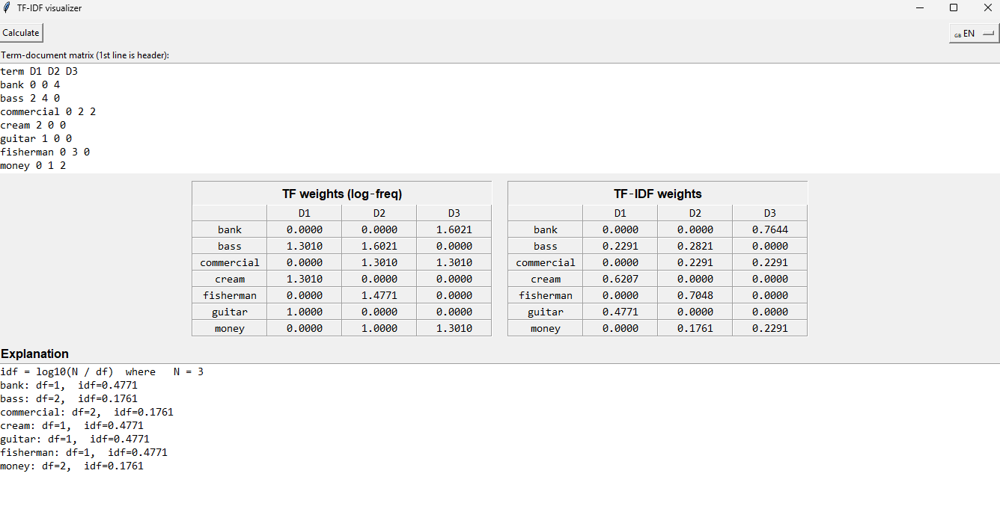

# TF-IDF Visualizer GUI

A lightweight, multilingual desktop application to compute and visualize TF (log-frequency) and TF-IDF weights from your own term-document matrix, with step-by-step explanations in Portuguese, English and French.



---

## 🔍 What’s This Project?

This friendly Tkinter GUI lets you:

- **Paste or type** your term-document matrix (first line is header: term D1 D2 …).
- **Compute TF weights** using a log-frequency scheme (`1 + log₁₀(tf)`).
- **Compute IDF** as `log₁₀(N/df)` (N = number of documents).
- **Calculate TF-IDF** = TF × IDF for every term/document.
- **Switch languages** (🇵🇹 PT, 🇬🇧 EN, 🇫🇷 FR) and see all labels and explanations update on the fly.
- **View results side-by-side**: TF table and TF-IDF table next to each other.
- **Read a detailed breakdown** of every calculation in the chosen language.

---

## 📚 Why TF-IDF?

TF-IDF (Term Frequency–Inverse Document Frequency) is a classic weighting scheme in Information Retrieval and NLP:

1. **TF (Term Frequency)** measures how often a term appears in a document.
2. **IDF (Inverse Document Frequency)** penalizes common terms across the collection and boosts rare, informative terms.
3. **TF-IDF** highlights words that are both frequent in a document and rare in the corpus, enabling better document representation for search, clustering or classification.

---

## 📝 Example Workflow

1. **Enter matrix**:
   ```txt
   term D1 D2 D3
   bank 0 0 4
   bass 2 4 0
   commercial 0 2 2
   cream 2 0 0
   guitar 1 0 0
   fisherman 0 3 0
   money 0 1 2
   ```
